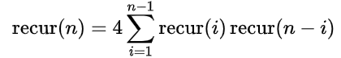
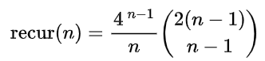
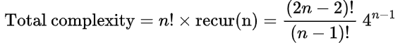

# Make24 Solver

This repository compares two implementations of the classic 24 Game solver:

- `24solver.py`: a Python brute-force approach that permutes numbers and builds expressions exhaustively.
- `24solver.c`: a C implementation that uses a recursive pick-two strategy to reduce the set of values one step at a time.

The goal is to explore how different algorithmic strategies affect performance and structure for the same problem.

## Project Structure

- `24solver.py` - Python brute-force solver.
- `24solver.c` - C recursive solver using pairwise reduction.
- `README.md` - this comparative overview.

## Requirements

### Python version
- Python 3.x
- `tqdm` package (used by `24solver.py` for progress display)

Install dependencies with:

```bash
pip install tqdm
```

### C compiler
- A C compiler such as `gcc` is required to build `24solver.c`.

## How to run

### Python brute-force solver

From the repository root:

```bash
python 24solver.py
```

### C pick-two solver

Compile the C program and run it:

```bash
gcc -std=c11 -O2 24solver.c -o 24solver
./24solver
```

### To use the program
Follow the prompts to enter the numbers and target:

1. Enter the input numbers separated by spaces.
2. Enter the target number.
3. Choose whether to generate all possible solutions (`y`) or stop after the first match (`n`).

## Example usage (for both `24solver.py` and `24solver.c`)

```text
Enter numbers (space-separated): 3 3 8 8
Enter target number: 24
Generate all possible arithmetic expressions of the input numbers? (y/n): y
```

## Comparison of strategies

### Python brute-force (`24solver.py`)

- Explores every ordered permutation of the input numbers.
- Recursively constructs every possible arithmetic expression from each permutation.
- Best suited for clarity and exhaustive solution listing.

### C recursive pick-two strategy (`24solver.c`)

- Selects two numbers at a time and replaces them with the result of a chosen operation.
- Reduces the search space recursively, avoiding explicit full permutation enumeration in every recursive branch.
- Best suited for performance and demonstrating a different way to solve the same problem.


## Time complexity analysis of `24solver.py`
Let `n` be the number of numbers in the input list. Let `recur(n)` be the number of different arithmetic expressions returned for a SINGLE permutation of numbers (which is NOT the overall complexity of the program).
- Base case of `recur()`: `recur(1)` returns 1 expression, and `recur(2)` returns 4 expressions.
- Recursive case of `recur()`: for `n > 2`, `recur(n)` constructs all arithmetic expressions by splitting the list into two non-empty parts, and combining one expression from the left part with one from the right part using the 4 operators. Therefore, the recurrence form is given by:



- This recurrence has a closed form, valid for at least `n = 1` through `n = 10`:



The program then iterates over every ordered permutation of the input numbers, and there are `n!` such permutations.
- For each permutation, it calls `recur()` once and evaluates every generated expression.
Therefore, the overall number of evaluated expressions is:



## Time complexity analysis of `24solver.c`
Let `n` be the number of numbers in the input list. Let `recur(n)` be the number of different arithmetic expressions returned for ALL permutations of numbers (which IS the overall complexity of the program).
- Base case of `recur()`: `recur(1)` evaluates 1 expression, and `recur(2)` evaluates 6 expressions.
- Recursive case of `recur()`: for `n > 2`, `recur(n)` first picks 2 numbers (say `a` and `b`), and combine them into 1 using `a+b`, `a-b`, `b-a`, `a*b`, `a/b`, `b/a`. Then `recur(n-1)` is called with this new number and the untouched numbers. Therefore, the recurrence form is given by:


This recurrence, which is also the overall number of evaluated expressions, has a closed-form:


## Performance comparison between `24solver.py` and `24solver.c`
Assuming runtime scales directly with the total number of evaluated expressions, and taking `n = 6` as the reference point for the estimated runtime for `n > 6`, the execution time of `24solver.py` and `24solver.c` are illustrated in the following table:

| n | Evaluated expressions|      | Execution time  | |
| | `24solver.py`|`24solver.c`    |`24solver.py` |`24solver.c`|
|---:|---:|---:|---:|---:|
| 1 | 1            | 1            | 0.018 s      | 0.000 s
| 2 | 8            | 6            | 0.022 s      | 0.000 s
| 3 | 192          | 108          | 0.075 s      | 0.001 s
| 4 | 7,680        | 3,888        | 1.76 s       | 0.004 s
| 5 | 430,080      | 233,280      | 90.0 s       | 0.057 s
| 6 | 3.10 * 10^7  | 2.10 * 10^7  | 2.1 hours    | 3.830 s
| 7 | 2.72 * 10^9  | 2.65 * 10^9  | 7.7 days     | 8.10 mins
| 8 | 2.83 * 10^11 | 4.44 * 10^11 | 26.6 months  | 22.5 hours
| 9 | 3.40 * 10^13 | 9.60 * 10^13 | 266 years    | 203 days
| 10| 4.63 * 10^15 | 2.59 * 10^16 | 36,300 years | 149 years
