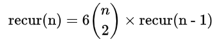
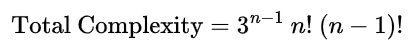

# Make24 Solver

This repository compares two implementations of the classic 24 Game solver:

- `24solver.py`: a Python brute-force approach that permutes numbers and builds expressions exhaustively.
- `24solver.c`: a C implementation that uses a recursive pick-two strategy to reduce the set of values one step at a time.

The goal is to explore how different algorithmic strategies affect performance and structure for the same problem.


## Requirements

### Python version
- Python 3.x
- `tqdm` package (used by `24solver.py` for progress display)

Install dependencies with:

```bash
pip install tqdm
```

### C compiler
- A C compiler such as `gcc` is required to build `24solver.c`.

## How to run

### Python brute-force solver

From the repository root:

```bash
python 24solver.py
```

### C pick-two solver

Compile the C program and run it:

```bash
gcc -std=c11 -O2 24solver.c -o 24solver
./24solver
```

### To use the programs (for both `24solver.py` and `24solver.c`)
Follow the prompts to enter the numbers and target:

1. Enter the input numbers separated by spaces.
2. Enter the target number.
3. Choose whether to generate all possible solutions (`y`) or stop after the first match (`n`).

## Example usage (for both `24solver.py` and `24solver.c`)

```text
Enter numbers (space-separated): 3 3 8 8
Enter target number: 24
Generate all possible arithmetic expressions of the input numbers? (y/n): y
```

## Testing

A correctness test suite lives in `testcase/`. It runs both solvers as subprocesses
against 40 known test cases spanning problem sizes `n = 1` through `n = 5`, then writes
a detailed report to `testcase/report.txt`.

### What the test script does

- Runs each solver in **first-solution** mode and verifies the returned expression
  evaluates to the expected target.
- Runs each solver in **all-solutions** mode (for `n ≤ 4`) and verifies **every**
  expression it returns evaluates correctly.
- Checks that both solvers agree on whether a solution exists.
- Detects crashes, timeouts, and encoding issues.
- Records execution time from each solver per test case.
- The test cases are defined externally in `testcase/test_cases.txt` — not hardcoded.

### How to run the test script

From the repository root:

```bash
python testcase/test_solver.py
```

The C solver is auto-compiled if the binary is missing or out of date.

Console output is compact — a `+` per passing test, with failures listed at the end.
Full details (per-case times, solution counts, error messages) are written to
`testcase/report.txt`.

> The suite uses 40 test cases and typically completes in **around 2 minutes**.
> Most of that time is spent on the `n = 5` unsolvable case, where the Python solver
> exhaustively searches all permutations (~90 s).

### Modifying test cases

Open `testcase/test_cases.txt`. Each line is pipe-delimited:

```
# numbers | target | solvable(y/n) | all_sol(y/n) | description
6 4 | 24 | y | y | n=2: multiply 6*4
```

- **numbers** — space-separated integers.
- **target** — the target value.
- **solvable** — `y` if a solution exists, `n` if none exists (the test asserts this).
- **all_sol** — `y` to also verify all-solutions mode; `n` to run first-solution only.
- **description** — free-form label shown in the report.

Lines starting with `#` are comments and blank lines are ignored.

> **Caution:** Setting `all_sol = y` with problem size `n ≥ 5` is not recommended —
> the Python solver takes ~90 s for `n = 5`. Adding a test case with `n ≥ 6` and
> `all_sol = y` can cause the test script to run for **over 2 hours** (see the
> performance table below).

## Comparison of strategies

### Python brute-force (`24solver.py`)

- Explores every ordered permutation of the input numbers.
- Recursively constructs every possible arithmetic expression from each permutation.

### C recursive pick-two strategy (`24solver.c`)

- Selects two numbers at a time and replaces them with the result of a chosen operation.
- Reduces the search space recursively, avoiding explicit full permutation enumeration in every recursive branch.


## Time complexity analysis of `24solver.py`
Let `n` be the number of numbers in the input list. Let `recur(n)` be the number of different arithmetic expressions returned for a SINGLE permutation of numbers (which is NOT the overall complexity of the program).
- Base case of `recur()`: `recur(1)` returns 1 expression, and `recur(2)` returns 4 expressions.
- Recursive case of `recur()`: for `n > 2`, `recur(n)` constructs all arithmetic expressions (of a single permutation of numbers) by splitting the list into two non-empty parts, and combining one expression from the left part with one from the right part using the 4 operators. Therefore, the recurrence form is given by:


- This recurrence has a closed form, valid for at least `n = 1` through `n = 10`:


The program then iterates over every ordered permutation of the input numbers, and there are `n!` such permutations. For each permutation, it calls `recur()` once and evaluates every generated expression. Therefore, the overall number of evaluated expressions is:


## Time complexity analysis of `24solver.c`
Let `n` be the number of numbers in the input list. Let `recur(n)` be the number of different arithmetic expressions returned for ALL permutations of numbers (which IS the overall complexity of the program).
- Base case of `recur()`: `recur(1)` evaluates 1 expression, and `recur(2)` evaluates 6 expressions.
- Recursive case of `recur()`: for `n > 2`, `recur(n)` first picks 2 numbers (say `a` and `b`), and combine them into 1 using `a+b`, `a-b`, `b-a`, `a*b`, `a/b`, `b/a`. Then `recur(n-1)` is called with this new number and the untouched numbers. Therefore, the recurrence form is given by:



This recurrence, which is also the overall number of evaluated expressions, has a closed-form:


## Performance comparison between `24solver.py` and `24solver.c`
The following performance data comes from the test suite (`testcase/test_solver.py`).
For `n = 1` through `n = 4` the average of all-solutions mode was used.
Assuming runtime scales directly with the total number of evaluated expressions, and
taking `n = 6` as the reference point for the estimated runtime for `n > 6`, the
execution time of `24solver.py` and `24solver.c` are illustrated in the following table:

| n  ||    Evaluated expressions  |              | Execution time|
|---:|---:|---:|---:|---:|
| | `24solver.py`|`24solver.c`    |`24solver.py` |`24solver.c`|
| 1 | 1            | 1            | 0.015 s      | 0.000 s
| 2 | 8            | 6            | 0.017 s      | 0.000 s
| 3 | 192          | 108          | 0.059 s      | 0.000 s
| 4 | 7,680        | 3,888        | 1.68 s       | 0.001 s
| 5 | 430,080      | 233,280      | 90.0 s       | 0.057 s
| 6 | 3.10 × 10^7  | 2.10 × 10^7  | 2.1 hours    | 3.830 s
| 7 | 2.72 × 10^9  | 2.65 × 10^9  | 7.7 days     | 8.10 mins
| 8 | 2.83 × 10^11 | 4.44 × 10^11 | 26.6 months  | 22.5 hours
| 9 | 3.40 × 10^13 | 9.60 × 10^13 | 266 years    | 203 days
| 10| 4.63 × 10^15 | 2.59 × 10^16 | 36,300 years | 149 years

## Observations

### 1. The Mathematical Tipping Point (n = 8)

Observation: From `n = 1` to `n = 7`, the pick-2 strategy (C program) evaluates fewer expressions than the brute-force solver (Python). At `n = 8`, the trend flips and the pick-2 strategy evaluates more expressions (`2.83 × 10^11` vs `4.44 × 10^11`), and the gap continues to widens at `n = 9` and `n = 10`.

Explanation: This reflects the underlying growth rates of the two recurrence models. The pick-two formula has a larger asymptotic growth than the Catalan-based brute-force recurrence. For small `n`, the reduction factor in the pick-two method still keeps its expression count lower. Beyond `n = 8`, however, the factorial-like growth of the pick-two strategy overtakes the brute-force strategy and creates a mathematical crossover point.

One explanation for this unexpected observation could be that the pick-2 strategy will generate identical expressions in different iterations (while the brute-force solver will never). For example, in an iteration, the pick-2 algorithm may first pick `(A-B)`, then `C*D`, then combine these expression to create `(A-B) / C*D`. In another iteration, it may first pick `C*D`, then `(A-B)`, then combine these expression to create `(A-B) / C*D` again (because when combining two numbers `a` and `b`, 6 expressions, including `a/b`, `b/a`, are generated.)

### 2. The Staggering Language Speed Discrepancy

Observation: At `n = 6`, both algorithms evaluate a comparable number of expressions (`3.10 × 10^7` vs `2.10 × 10^7`). Despite this, the Python program takes `2.1 hours` while the C program finishes in `3.83 seconds`.

Explanation: This highlights the large runtime overhead of interpreted Python when it must translate its code line-by-line during execution. Moreover, this Python program uses `eval()` to evaluate arithmetic expression, where the interpreter must parse the string, compile it into an Abstract Syntax Tree (AST), execute it, and garbage-collect the memory, further worsening the performance of the Python program. Even with similar expression counts, the language execution models still introduce a huge speed gap (`4,100 expr/s` vs `5,480,000 expr/s`).

### 3. Execution Time Inversion (n ≥ 8)

Observation: At `n = 8, 9, 10`, the C program evaluates more expressions than Python, yet it still finishes much faster (e.g. `22.5 hours` vs `26.6 months` at `n = 8`).

Explanation: C’s raw execution speed compensates for the worse asymptotic expression count. The pick-two algorithm is algorithmically less efficient for large `n`, but compiled C can still process far more paths in a shorter wall-clock time than interpreted Python. Because C executes instructions 1300 times faster than the Python program (as deduced in the above for `n = 6`), the Pick-2 algorithm (C program) would have to evaluate 1300 times more expressions than the brute-force method (Python) before this C program would actually take longer to run.

### 4. The Python Startup Penalty (n = 1 and n = 2)

Observation: At `n = 1`, Python takes `0.018s` to evaluate a single expression. At `n = 2`, Python’s expression count jumps 8× but execution time barely changes (`0.018s` to `0.022s`). On the other hand, C takes close to no time to evaluate a few expressions at `n = 1, 2`.

Explanation: The initial cost is dominated by Python interpreter startup, module loading, and runtime overhead, not the arithmetic itself. For tiny inputs, Python’s fixed overhead is the main cost, while C’s compiled binary executes with almost no startup penalty.

### 5. The Combinatorial Wall (n ≥ 10)
Observation: Extrapolating to `n = 10`, the C program still takes `149 years`, even though it is much faster than the Python estimate of `36,300 years`.

Explanation: This shows the limits of language speed against factorial complexity. No matter how optimized the implementation, an algorithm with exponential and factorial complexity will eventually hits a physical hardware wall. To solve `n ≥ 10` in a reasonable time, a fundamentally different algorithm is required, rather than just faster execution speed.

## Future Direction
- Add memoization or state deduplication to both solvers to avoid redundant subproblem exploration.
- Create a C brute-force program, and auto-determine which algorithm (brute-force vs pick-two) to use depending on the requested size of problem of the extended 24 game.
- Measure actual runtime and memory usage for both implementations instead of relying only on theoretical estimates.